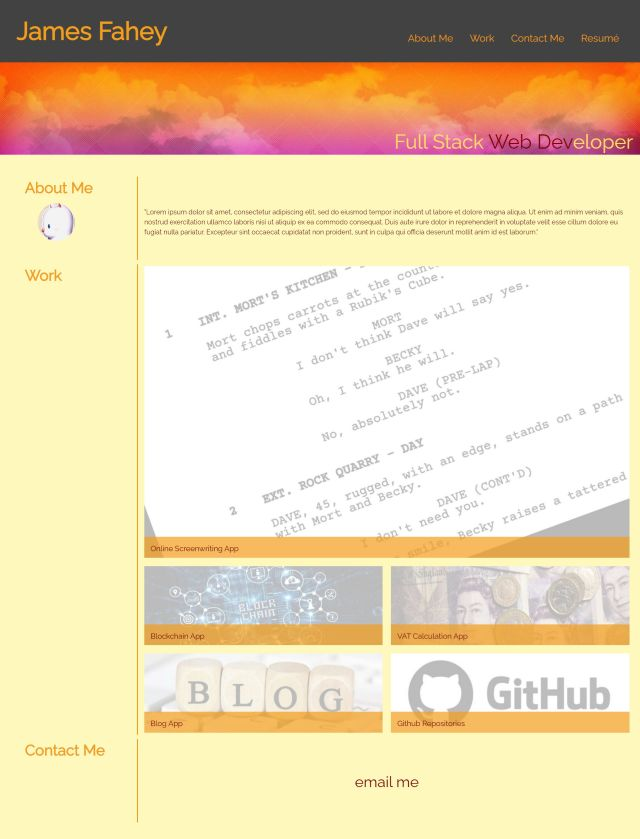

# personal-portfolio

<<<<<<< HEAD

## Responsive Design and Accessibility

These were my two watchwords when starting this challenge. It's not a big project, so the accessibility aspects of the page were just the links being underlined when the pointer is over them, and aria labels being used in the HTML rather than "alt" tags because the images were background images due to the design considerations - the labels on the pictures are something we did in class in module two, which look very effective.

I inserted two media query breakpoints, and eventually got the page to display down to a width of 320 pixels. To do this without looking messy I had to make the avatar invisible and resize all the fonts twice. The labels on the images resized nicely with the text links remaining clear and staying within the images. The email link at the bottom was originally a button I made at css3buttongenerator.com, but I couldn't make it look like a natural part of the page, so I went for a text link instead.

At this moment in time I don't have any projects deployed on the web - we're only two weeks into the bootcamp. But the links I have put in the grid are projects I have planned. The VAT calculator I originally wrote in Python to speed up my work for the accountants I used to work for. I will be making an (hopefully) attractive interface and coding it in JavaScript. The scriptwriting app I want to make as a cheap alternative to expensive industry standard software like Final Draft. The blockchain app I will be making for my friend who is interested in that sort of thing. I have also included a link to my Github repositories, which will hopefully contain some interesting projects in the near future
=======

>>>>>>> 2dcea4135e0d7283b2cf910e2882756f9e7a5ae0
